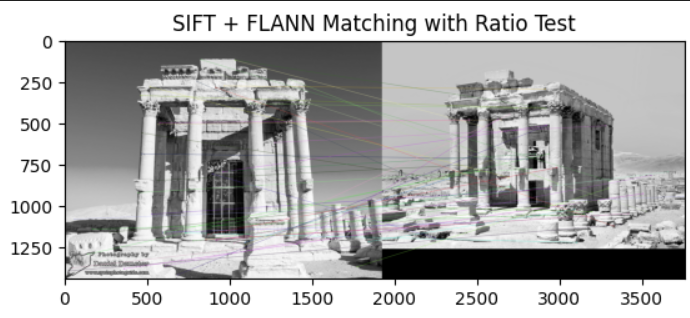

# 🔍 Feature Detection & Description in Action  
An exploration of **feature detection and description** techniques.  
This project compares **ORB and SIFT** methods on sample images to highlight their strengths and weaknesses in real-world computer vision tasks.  

---

## 📸 Example Results  

### ORB (FAST + Binary Descriptors)  
Fast and efficient, works well for real-time applications.  


### SIFT (Scale-Invariant Feature Transform)  
Robust to scale and rotation, but slower.  



---

## ⚡ Techniques Implemented  

- **Feature Detection**: Finding keypoints (corners, blobs, edges).  
- **Feature Description**: Computing feature vectors that describe keypoints.  
- **Matching**: Comparing features across images using Brute-Force or FLANN matcher.  

---

## 🚀 How to Run  

1. Clone this repo:
   ```bash
   git clone https://github.com/HanaNabhan/Feature-Detection-Description.git
   cd Feature-Detection-Description
